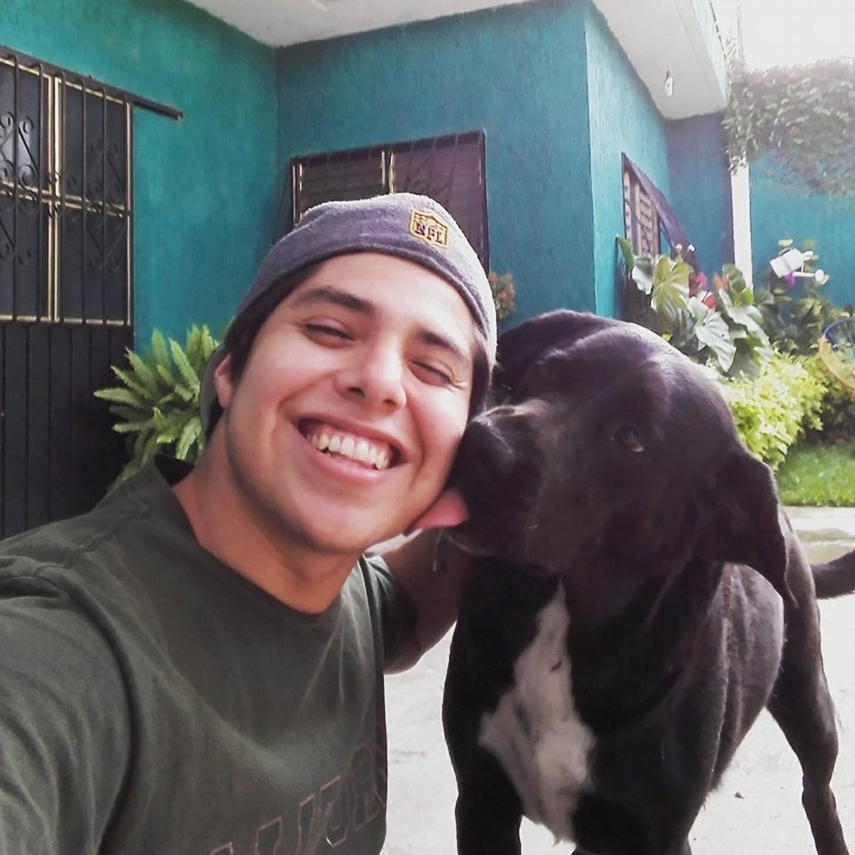

- __Name:__ Erick Cuevas Fernández
- __Ocupation:__ "Posgrade student"
- __Hobbies:__ Learning software development in R, machine learning and mental disorders. Cook, theater and dance "salsa" :D

***

 **Self-taught**, **enthusiastic** and **passionate** about learn more. **Big data** and **Machine Learning**. Pharmaceutical Industrial Laboratory Technician and Undergraduate in Sciences with terminal area in **Biochemistry** and **Molecular Biology**. Currently a master's student in **Biochemical Sciences** of the National Autonomous University of Mexico [UNAM, Universidad Nacional Autónoma de México](http://www.mdcbq.posgrado.unam.mx/).
 

 I graduated from the [Universidad Autonoma del Estado de Morelos (UAEM)](http://www.cidc.uaem.mx) with a bachelor in science with specialty in Molecular Biology and Biochemistry in 2017, I completed my undergraduate thesis urder the advisement of [Dra. Angelica Santana Calderón](http://www.cidc.uaem.mx/angelicasantana/) . In 2018 I began a maester degree in Biochemical Science from  [Universidad Nacional Autonoma de México (UNAM)](http://www.mdcbq.posgrado.unam.mx/), where I am investigating **single nucleotide polymorphisms** associated with **dementia** using **artificial intelligence** under the advisement of [Dr. Heriberto Manuel Rivera](https://www.uaem.mx/organizacion-institucional/uploads/facultades/medicina/files/Dr.HeribertoManuelRivera.pdf) at UAEM, [Dra. Leonor Perez Martinez](http://www.ibt.unam.mx/server/PRG.base?tipo:doc,dir:PRG.curriculum,par:leonor) and [Dr. Alejandro Garcia Rubio Granados](http://www.ibt.unam.mx/server/PRG.base?tipo:doc,dir:PRG.curriculum,par:alejandro) at UNAM. Master in Sciences Honorific Mention and nominated to Alfoso Caso's Medal.

My full CV is available [here](files/CV_2019.pdf).

      
