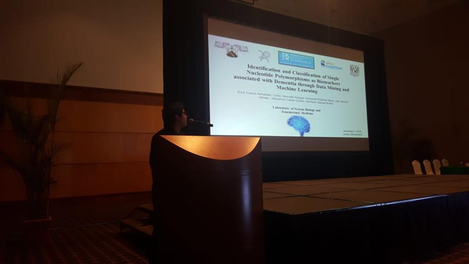

- IV Congress of Signal Transduction. Puerto Vallarta, Jal. - Poster presentation: “Differential recruitment of beta-catenin to the promoters of genes associated with proliferation and differentiation in neonate and adult CD8 + T cells”. 2017.
- XXXII National Congress of Biochemistry. Ixtapa, Guerrero. - Oral presentation: “Identification and Classification of Single Nucleotide Polymorphism associated with dementia through data mining and machine learning”. 2018.
- Refresher course for 8th semester nursing students. Oral presentation: "Artificial intelligence". 2019.

***

