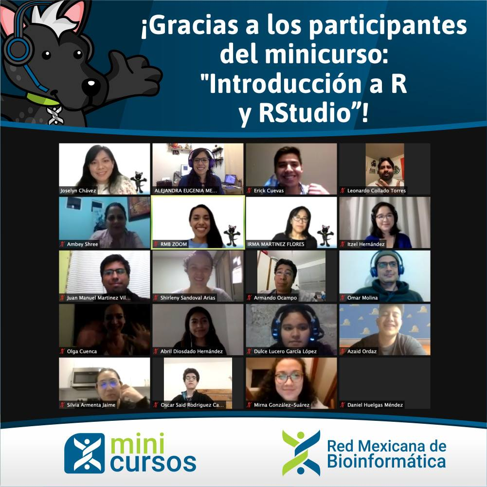
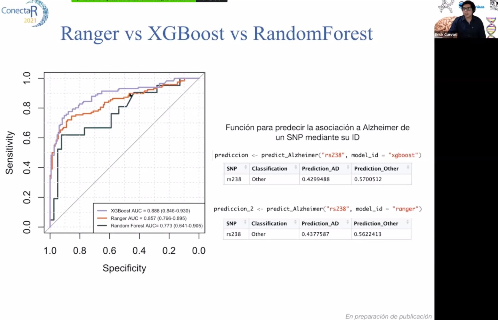

- IV Congress of Signal Transduction. Puerto Vallarta, Jal. - Poster presentation: **“Differential recruitment of beta-catenin to the promoters of genes associated with proliferation and differentiation in neonate and adult CD8 + T cells”**. 2017.
- XXXII National Congress of Biochemistry. Ixtapa, Guerrero. - Oral presentation: **“Identification and Classification of Single Nucleotide Polymorphism associated with dementia through data mining and machine learning”**. 2018.
- Refresher course for 8th semester nursing students. Oral presentation: **"Artificial intelligence"**. 2019.
- Jornadas de bienvenida al semestre. Facultad de Nutrición UAEM. **"Inteligencia Artificial: ¿Realidad o ciencia ficción?"**. 2019
- Mini Curso de la Red Mexicana de Bioinformatica. **[Introducción a R y RStudio](https://www.youtube.com/watch?v=rtyv49poP_k&feature=youtu.be)**. 2020
- **[SNPverso y Demencia](https://speakerdeck.com/erickcf/snpverso-y-demencia-conectar-2021)**. [ConectaR 2021](https://conectar2021.github.io/ConectaR2021/agenda/). 
- **[Presentación de Comunidades CDSB](https://speakerdeck.com/erickcf/cdsb-conectar-2021)**. [ConectaR 2021](https://conectar2021.github.io/ConectaR2021/agenda/)

***

***

***

