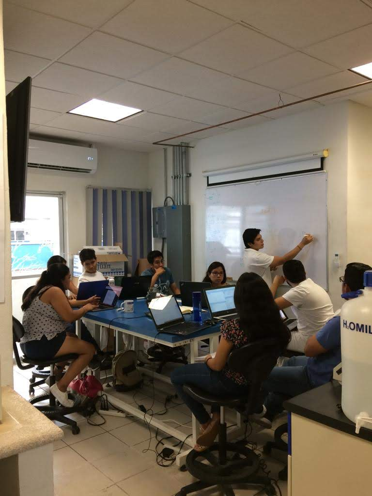

***
#### Curso R Laboratorio de Biología de Sistemas y Medicina Translacional 2019

**Material del curso:**

- [Requisitos](https://github.com/Erickcufe/Curso-R-2019/blob/master/Requisitos.pdf) 
- **Clase 1**
  - [Presentacion](https://github.com/Erickcufe/Curso-R-2019/blob/master/Clase_introduccion.md)
  - [Material](https://github.com/Erickcufe/Curso-R-2019/blob/master/Clase1.pdf)
- **Clase 2**
  - [Presentacion](https://github.com/Erickcufe/Curso-R-2019/blob/master/Clase_2.md)
  - [Material](https://github.com/Erickcufe/Curso-R-2019/blob/master/Clase-2.pdf)
  
- **Clase 3**
  - [Presentacion](https://github.com/Erickcufe/Curso-R-2019/blob/master/Clase_3/Clase%203.md)
  - [Material](https://github.com/Erickcufe/Curso-R-2019/blob/master/Clase_3/Clase_3.pdf)
  
- **Clase 4**
  - [Presentacion](https://github.com/Erickcufe/Curso-R-2019/blob/master/Clase_4/Actividades_clase4.md)
  - [Material](https://github.com/Erickcufe/Curso-R-2019/blob/master/Clase_4/ggplot2-cheatsheet.pdf)

- **Clase 5**
  - [Presentacion](https://github.com/Erickcufe/Curso-R-2019/blob/master/Clase5/Clase_5_functions.md)

***

#### Curso R Análisis Exploratorio de Datos 2020 

- [*Requisitos*]("files/Requisitos.pdf")

- [Introducción](https://youtu.be/CJQUEcsz4Zk)

- [Introducción a Rstudio: Vectores y Listas](https://youtu.be/pSm5yq0LIHw)

- [Manejo de Data Frame](https://youtu.be/Lwia2RyEBzY)

- [Análisis Exploratorio I: Limpieza de NA's, subsetting y Plots básicos](https://youtu.be/NdCTI7EZPpg)

***

#### Curso R Avanzado 2020 

- [Subsetting avanzado](https://youtu.be/RaTLklA12c4)

***
**Material extra:** 

- [Advanced R; Hadley Wickham](https://adv-r.hadley.nz)
- [R Packages; Hadley Wickham](http://r-pkgs.had.co.nz)
- [R for Data Science; Hadley Wickham & Garret Grolemund](https://es.r4ds.hadley.nz/)
- [R for Beginners; Emmanuel Paradis](https://cran.r-project.org/doc/contrib/Paradis-rdebuts_en.pdf)
- [R tutorial begginers](https://www.statmethods.net/r-tutorial/index.html)
- [Mastering Shiny](https://mastering-shiny.org)
- [R Markdown Cookbook](https://bookdown.org/yihui/rmarkdown-cookbook/)
- [Forecasting: Principles and Practice](https://otexts.com/fpp2/)
- [Leaflet for R](https://rstudio.github.io/leaflet/)
- [Creating APIs in R with Plumber](https://www.rplumber.io/docs/index.html#web-apis)
- [Initiating development of a chatbot](https://www.r-bloggers.com/initiating-development-of-a-chatbot-with-plumber-and-ngrok/)

**Cheat Sheets**

- [RStudio IDE Cheat Sheet](https://www.rstudio.com/wp-content/uploads/2016/01/rstudio-IDE-cheatsheet.pdf)
- [Data visualization with ggplot2 Cheat Sheet](https://www.rstudio.com/wp-content/uploads/2015/03/ggplot2-cheatsheet.pdf)

**Websites for R news and community**

- [R weekly](https://rweekly.org)
- [RStudio community](https://community.rstudio.com)
- [CDSB](https://comunidadbioinfo.github.io/es/#about)

